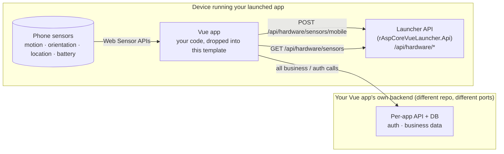

# rAspCoreVueLauncher

A device-side **Launcher** that gives any Vue app first-class access to mobile hardware sensors (motion, orientation, location, battery, connectivity). Drop your existing Vue app in, add one import, and the readings start flowing — no Rust, no Capacitor plugin authoring.

This repo is the **Launcher** — it is **not** your app's backend. Each Vue app you build still has its own API for auth, business data, and persistence; that lives in your app's own repo and is unrelated to anything here.

## Architecture & terminology



| Term | What it is | Lives where |
|------|------------|-------------|
| **Vue app** | Your UI code. Owns business logic. | Your own repo. Gets dropped into `src/rAspCoreVueLauncher.Web/` in this template when you want sensor access. |
| **Per-app API** | The Vue app's own backend — auth, persistence, business endpoints. | Your own repo. Independent of this template. |
| **Launcher** | This whole template: the ASP.NET hardware service + the Tauri/Capacitor wrappers that bundle it with a Vue app on a device. | This repo. |
| **Launcher API** | The hardware-exposing ASP.NET service inside the Launcher. Talks to the Vue app over HTTP on the local device only. | `src/rAspCoreVueLauncher.Api/` |
| **`sensorsBridge.ts`** | One-line drop-in that wires browser Web Sensor APIs to the Launcher API. | `src/rAspCoreVueLauncher.Web/src/lib/sensorsBridge.ts` |

### Ports

| Service | Default port | How to change |
|---------|--------------|---------------|
| Vue dev server | `5172` | `PORT=<n>` in `.env.local` under `src/rAspCoreVueLauncher.Web/`. Increment by 1 per cloned app. |
| Launcher API (http) | `5202` | `applicationUrl` in `src/rAspCoreVueLauncher.Api/Properties/launchSettings.json`. |
| Launcher API (https) | `7202` | Same file. |
| Per-app API | whatever your app uses | Not in this repo. |

The Launcher API's dev CORS policy accepts any `http(s)://localhost:*` origin, so your Vue app can run on whatever port the clone needs without an API change.

## Stack

| Layer | Technology | Purpose |
|-------|-----------|---------|
| Backend | ASP.NET Core 10 Minimal API | Launcher API (hardware/sensors only) |
| Shared | .NET 10 class library | Hardware DTOs / wire contracts |
| Frontend | Vue 3 + Vite + TS + Tailwind v4 + shadcn-vue + Pinia + Vue Router | The UI |
| Desktop shell | Tauri 2 | Native window + hardware bridge |
| Mobile shell | Capacitor 7+ | iOS / Android packaging |
| Tests | MSTest + NSubstitute + FluentAssertions v6 | Contract + integration |

## Layout

```
src/
  rAspCoreVueLauncher.Shared/      # contracts shared between API and tests
  rAspCoreVueLauncher.Api/         # ASP.NET Core 10 minimal API
  rAspCoreVueLauncher.Web/         # Vue 3 app + Tauri + Capacitor config
    src/                           # Vue source
    src-tauri/                     # Tauri desktop shell (Rust)
    capacitor.config.ts            # Capacitor mobile config
tests/
  rAspCoreVueLauncher.Api.Tests/   # MSTest + WebApplicationFactory
.vscode/                           # launch.json, tasks.json, extensions.json
```

## Prerequisites

- .NET 10 SDK (`10.0.300` pinned via `global.json`)
- Node.js 22+
- **Optional, for desktop builds:** Rust toolchain (https://rustup.rs)
- **Optional, for mobile builds:** Android Studio (Android) and/or Xcode on macOS (iOS)

## Build & package

The first thing a new contributor runs is the host setup check. It verifies the toolchain and prints install hints — it does not install anything itself.

```pwsh
# Windows
pwsh scripts/setup.ps1

# Linux
./scripts/setup.sh
```

Both scripts accept `-SkipAndroid` / `--skip-android` and `-SkipDesktop` / `--skip-desktop` to suppress checks for toolchains you don't need.

Once setup reports clean, everything else is driven from the repo root via npm:

```pwsh
npm run setup              # dispatches to the right host script
npm run build              # dotnet build + Vue build
npm run test               # dotnet test
npm run clean              # wipes bin/obj/dist/target/build (add --deep to also wipe node_modules)
npm run package            # desktop + Android (if ANDROID_HOME set) + iOS (skipped off macOS)
npm run package:desktop    # Tauri bundle for the current host (Windows MSI / Linux deb + AppImage)
npm run package:android    # Capacitor + Gradle release APK; needs ANDROID_HOME, JDK 17, Android SDK
npm run package:ios        # prints "requires a macOS host" on Windows/Linux and exits cleanly
```

### What you can build from each host

| Host    | Desktop bundle           | Android APK | iOS  |
|---------|--------------------------|-------------|------|
| Windows | MSI                      | yes         | no   |
| Linux   | `.deb` + `.AppImage`     | yes         | no   |
| macOS   | `.app` / `.dmg` (not wired in this template) | yes | yes  |

## Run it

### From VS Code (recommended)

Open the folder and press **F5**. Pick a compound configuration:

- **Full Stack: API + Vue** — runs the ASP.NET API (with hot reload) plus the Vite dev server. Visit http://localhost:5173.
- **Full Stack: API + Tauri** — same, but the Vue app opens inside a Tauri desktop window. Requires Rust.

Individual configurations are also available (API only, Web only, Tauri only).

### From the terminal

```pwsh
# Terminal 1 — API at https://localhost:7202 (Scalar UI at /scalar/v1)
dotnet watch --project src/rAspCoreVueLauncher.Api run --launch-profile https

# Terminal 2 — Vue dev server at http://localhost:5173 (proxies /api to the backend)
cd src/rAspCoreVueLauncher.Web
npm run dev
```

## Bring your own Vue app

The bundled Vue project is a placeholder. If you already have a Vue 3 app, you can graft it onto this shell and reuse the ASP.NET API, the Tauri desktop wrapper, the Capacitor mobile wrapper, and the mobile-sensor ingest pipeline. Two paths are supported: replace the bundled Vue app with yours, or migrate the API + native shells into your repo. Mobile sensor reporting is one import and one call in `main.ts` — drop in `src/rAspCoreVueLauncher.Web/src/lib/sensorsBridge.ts` and call `startSensorBridge()`.

See [`docs/BYO-APP.md`](docs/BYO-APP.md) for the full guide, options reference, iOS permission gotcha, Capacitor permissions checklist, and troubleshooting.

## Hardware abstraction

`IHardwareService` in `rAspCoreVueLauncher.Shared` defines what the Vue frontend can ask about the device. Today: OS, architecture, machine name, cores, memory, and a `HardwareSensors` snapshot (CPU, memory, disks, network interfaces, battery, plus the latest mobile sensor reading). Add sensors here as the platform implementations grow.

- **Desktop (Tauri)**: the ASP.NET API runs as a sidecar process. Most hardware is reachable via .NET directly.
- **Mobile (Capacitor)**: things .NET can't reach from a webview process (camera, geolocation, accelerometer) are pushed to the API from the Vue layer. `POST /api/hardware/sensors/mobile` accepts a `MobileSensorReading` (motion / orientation / environment / location / health / biometric / connectivity / UI groups — see `src/rAspCoreVueLauncher.Shared/Hardware/HardwareSensors.cs`) and the latest reading is echoed back under the `mobile` field on `GET /api/hardware/sensors`.
- A drop-in module at [`src/rAspCoreVueLauncher.Web/src/lib/sensorsBridge.ts`](src/rAspCoreVueLauncher.Web/src/lib/sensorsBridge.ts) wires the standard Web Sensor APIs (DeviceMotion, DeviceOrientation, Geolocation, Battery, NetworkInformation) to that endpoint with zero dependencies. Call `startSensorBridge()` once at startup.

## Packaging notes

- Desktop bundles are produced by `npm run package:desktop` (Tauri 2). To ship the API alongside the desktop binary, publish a self-contained build and reference it as a Tauri `externalBin` sidecar in `src-tauri/tauri.conf.json`. (TODO — not wired in this template.)
- Android and iOS native platform folders aren't checked in. `npm run package:android` runs `npx cap add android` on demand before invoking Gradle. For mobile, the Vue app is served from the device — it must talk to a remote ASP.NET API rather than localhost. Configure the API base URL via Vite env vars before building.

## Handover & roadmap

- [`docs/HANDOVER.md`](docs/HANDOVER.md) — current state of the repo, verified vs. unexercised, known caveats.
- [`docs/CHANGELOG.md`](docs/CHANGELOG.md) — feature history, newest first.
- [`docs/ROADMAP.md`](docs/ROADMAP.md) — what's next (Tauri sidecar, codegen, distribution gaps, cleanup).
